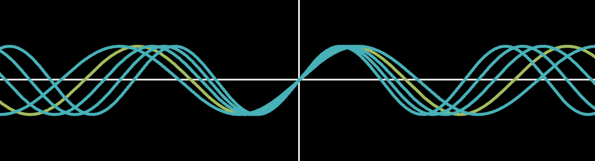

# recurrent-optimization

Looping a single MLP to learn $\sin(x)$ on $[-2\pib, 2\pib]$.  

| Record | Max $b$ | Recurrent depth | Description |
|---:|---:|---:|---|
| [0](records/000_no_normalization.py) | $8\pi$ | 8 | AdamW; no normalization |
| [1](experiment.py) | $24\pi$ | 8 | AdamW; fixed soft RMS clipping, $\tau=4$ |

```bash
uv run experiment.py
```

